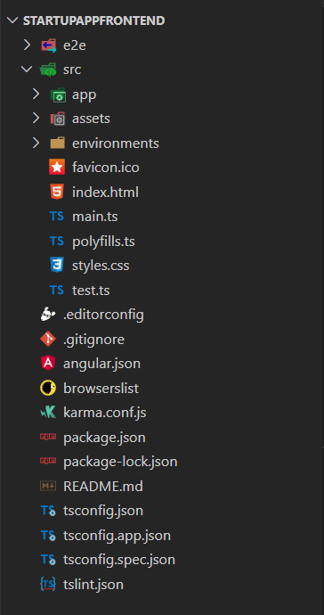

# Structure d'un projet Angular

 

 

## e2e 

Ce dossier va permettre de rédiger divers test end to end par le framework Protractor. 

## node_modules 

Ce sont les dépendances installées par NPM qui correspondent à celles déclarées dans package.json. 

## src

**app/app.component.(ts, html, css, spec.ts)** : Définit AppComponent avec un template HTML (.html), une feuille de style CSS (.scss ou .css) et un test unitaire (.spec.ts). C'est le composant racine de ce qui deviendra un arbre de composants imbriqués à mesure que l'application évolue. 

**app/app.module.ts** : Définit AppModule, le module racine qui indique à Angular comment assembler l'application. A l'initialisation du projet il déclare uniquement l'AppComponent. Bientôt, il y aura plus de composants déclarés.

**assets/***: Un dossier où vous pouvez mettre des images qui seront copiées directement lorsque vous construirez votre application.

**environments/*** : Ce dossier contient un fichier pour chacun de vos environnements de destination (généralement développement ou production), chacun exportant des variables de configuration simples à utiliser dans votre application.

**favicon.ico** : comme son nom l'indique, permet de configurer le favicon de votre application pour les navigateurs.

**index.html** : La page HTML principale qui est servie en premier lorsque quelqu'un visite votre site. La plupart du temps, vous n'aurez jamais besoin de le modifier. Le CLI ajoute automatiquement tous les fichiers JS et CSS lors de la création de votre application afin que vous n'ayez jamais besoin d'ajouter manuellement des balises 'script' ou 'link'. 

**main.ts** : Le point d'entrée principal de votre application. Compile l'application avec le compilateur JIT et bootstrap le module racine de l'application (AppModule) pour s'exécuter dans le navigateur. 

**polyfills.ts** : Différents navigateurs ont différents niveaux de compatibilité des standards web (et notamment de Javascript ES6/ES7). Polyfills aide à combler ces différences en s'assurant que votre application soit compatible sur tous les navigateurs. 

**styles.css (ou styles.scss)** : Vos styles globaux vont ici. La plupart du temps, vous voudrez avoir des styles locaux dans vos composants pour en faciliter la maintenabilité, mais les styles qui affectent l'ensemble de votre application doivent être dans ce fichier. 

**test.ts** : Il s'agit du point d'entrée principal de vos tests unitaires. Il a une configuration spéciale, mais ce n'est pas quelque chose que vous devriez modifier.

## Racine 

**.editorconfig** : Configuration simple pour votre éditeur pour vous assurer que tous ceux qui utilisent votre projet aient la même configuration de base (par exemple l'indentation, on vous laisse régler ça entre amis). La plupart des éditeurs prennent en charge ce fichier. 

**.gitignore** : fichier git pour vous assurer que les fichiers générés automatiquement ne sont pas pris en compte. Par exemple les dépendances (/node_modules), ainsi que le build du projet (/dist). 

**angular.json** : Fichier de configuration pour Angular CLI qui contient certains hyper paramètres importants, tel que le dossier de sortie pour les builds de production, les dossiers contenant les fichiers de styles ou encore les assets, la page HTML principal à afficher, etc, vous pouvez par exemple configurer le nom et l'emplacement du folder où sera buildé votre projet ("outputPath": "dist/monProjet" par défaut)

**browserslist** : Ce fichier contient une configuration permettant de paraméter les versions des navigateurs qui doivent être supportées par le JavaScript transpilé depuis le Typescript que vous écrivez. 

**karma.conf.js** : Configuration de Karma permettant de réaliser les tests unitaires et qui est utilisée lors de l'exécution de ng test.

**package.json** : Configuration npm listant les paquets tiers que votre projet utilise (les dépendances). Vous pouvez également ajouter vos propres scripts personnalisés ici. 

**package-lock.json** : Arbre exacte des dépendances et de leurs propres dépendances, permettant de réinstaller exactement les mêmes versions dans votre équipe. 

**README.md** : Documentation de base pour votre projet, pré-remplie d'informations de commande CLI. Assurez-vous de l'améliorer avec la documentation du projet afin que quiconque puisse builder votre application en suivant les instructions contenues dans ce fichier ! 

**tsconfig.app.json** : Extension de la configuration du compilateur TypeScript pour compiler votre application. 

**tsconfig.json** : Configuration du compilateur TypeScript pour compiler votre application. Ce fichier est également utilisé par votre IDE afin de vous donner des informations utiles (mauvais type d'input par exemples). 

**tsconfig.spec.json** : Extension de la configuration du compilateur TypeScript pour compiler les tests pour votre application.

**tsconfig.spec.json** : Extension de la configuration du compilateur TypeScript pour compiler les tests pour votre application. 

**tslint.json** : Configuration de TSLint qui est exécuté par ng lint . Permet de vérifier le code typescript pour s'assurer de sa maintenabilité et de détecter certaines erreurs (absence de point virgule, mauvais guillemets etc). Les règles sont entièrement paramétrables.

